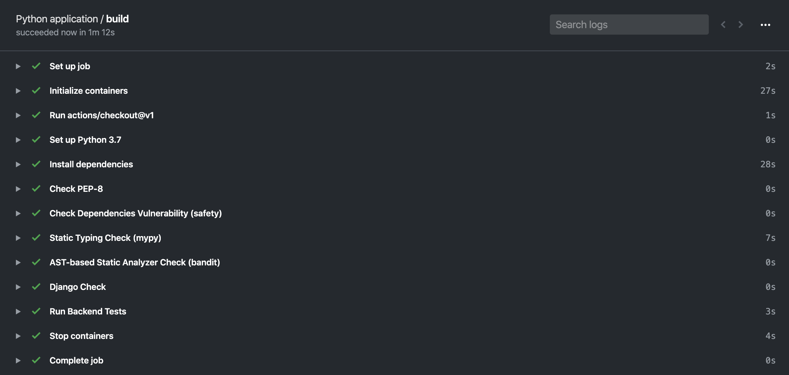
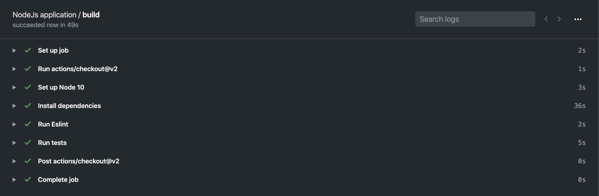

# Crawler Challenge

## Requirements

Backend:

- Use Python
- Use Django
- Use Django Rest Framework in the API layer.
- Write unit tests

Frontend:

- Use React and Hooks
- Use Semantic UI React
- Write unit tests.

## Building the Project (with Docker)

Clone the repository

```
$ git clone git@github.com:bahattincinic/crawler-challenge.git
$ cd crawler-challenge
$ cp backend/crawler/settings/dev.py-dist backend/crawler/settings/dev.py
```

build docker images with the following link

```
$ docker-compose up -d --build
```

Apply Database migrations

```
$ docker exec -it djangoapp bash
$ python manage.py migrate
```

Import data with crawler

```
$ python manage.py crawl_products
```

Open http://localhost:3000


## Running Unit Tests

Frontend:

```
$ docker exec -it frontend bash
$ yarn run test
```

Backend:

```
$ docker exec -it djangoapp bash
$ python manage.py test
```

## API

Fetch products

```
URl: GET http://localhost:8000/api/products/
```

Compare HTML Files

```
URl: POST http://localhost:8000/api/compare/
{
  "from_product": 1,
  "to_product": 2
}
```

## Linter & Github Actions

I also added a linter and static analyzer to the projects.

Backend Linter (Github Actions)

https://github.com/bahattincinic/crawler-challenge/blob/master/.github/workflows/backend_linter.yml



Frontend Linter (Github Actions)

https://github.com/bahattincinic/crawler-challenge/blob/master/.github/workflows/frontend_linter.yml


